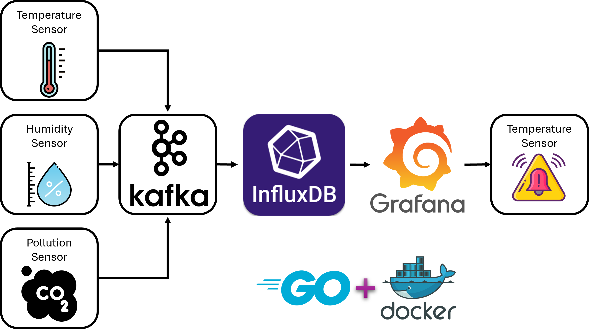
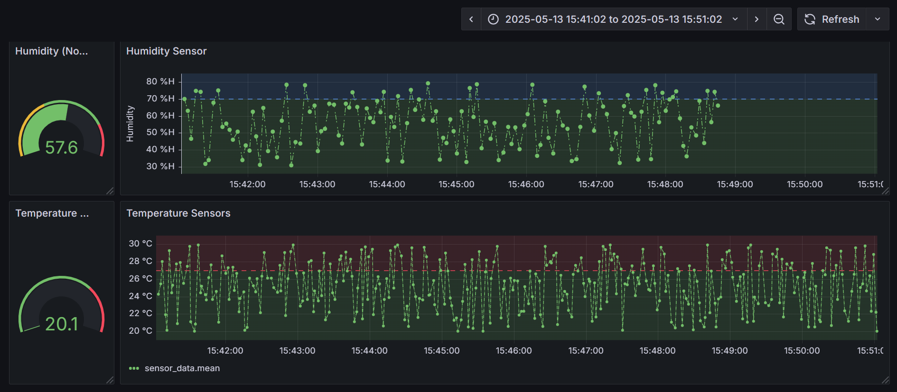

# 🛰️ IoT Sensor Simulator System

This project simulates multiple IoT sensors (e.g., temperature and humidity) using **Go**, sends their data to **Kafka**, stores it in **InfluxDB**, and visualizes and monitors it via **Grafana** — all containerized using **Docker Compose**.

---

## 🧱 System Architecture

- **Sensor Simulator (Go)** – Simulates multiple sensors concurrently and publishes readings to Kafka using a YAML config.
- **Kafka** – Message broker for real-time data.
- **Kafka Consumer (Go)** – Reads messages from Kafka and writes them to InfluxDB.
- **InfluxDB** – Time-series database for storing sensor data.
- **Grafana** – Visualizes sensor data and supports alerting.
- **Docker Compose** – Orchestrates all components for local or cloud deployment.

### 📷 Architecture Diagram



### 📷 Grafana Example



---

## 🚀 Getting Started

### 📦 Prerequisites

- Docker
- Docker Compose

### 🔧 Build & Run

```bash
docker compose up --build -d
```

This will spin up all services:

- Sensor simulator (multi-sensor via config.yaml)
- Kafka + Zookeeper
- Kafka UI
- InfluxDB
- Grafana
- Kafka → InfluxDB consumer

---

## ⚙️ Configuration

### `config.yaml` (multi-sensor setup)

Configure multiple sensors in one file:

```yaml
sensors:
  - id: sensor-1
    type: temperature
    interval: 2s
  - id: sensor-2
    type: humidity
    interval: 3s
  - id: sensor-3
    type: temperature
    interval: 5s
```

This file is loaded at runtime and each sensor runs in a separate goroutine.

---

## 📊 Grafana Dashboard

- Access: [http://localhost:3000](http://localhost:3000)
- Login: `admin` / `admin`
- Add InfluxDB data source:
  - URL: `http://influxdb:8086`
  - Database: `sensors`
- Create panels using queries like:

```sql
SELECT mean("value") FROM "sensor_data"
WHERE "type" = 'temperature' AND $timeFilter
GROUP BY time($__interval)
```

---

## 🔔 Alerts

You can configure alerts in Grafana based on thresholds (e.g., temperature > 30°C) and route them to email, Slack, or webhook via **Alerting → Notification Policies**.

---

## 📁 Project Structure

```
.
├── docker-compose.yml
├── config.yaml             # ✅ multi-sensor configuration file
├── sensors/                # Go code for sensor simulator
├── influx-writer/          # Go code for Kafka-to-Influx consumer
├── Dockerfile              # Multi-stage build for Go app
├── init-sensors.iql        # Creates InfluxDB database if needed
└── docs/
    ├── system-diagram.png
    └── grafana-dashboard.png
```

---

## 🛠 Technologies Used

- Go 1.21+
- Docker & Docker Compose
- Kafka + Zookeeper
- InfluxDB 1.8
- Grafana
- Kafka UI

---

## 👨‍💻 Author

Built by [Majid Khorashadi](https://github.com/your-github)

---

## 📝 License

MIT License. See `LICENSE` file for details.
